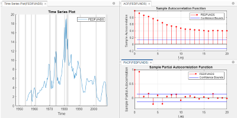
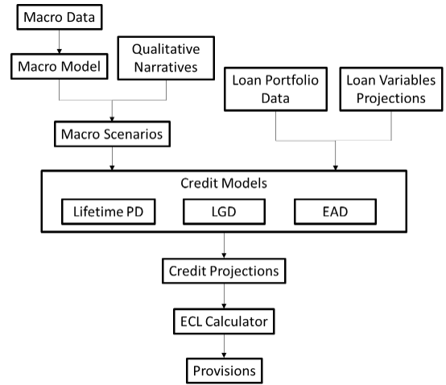
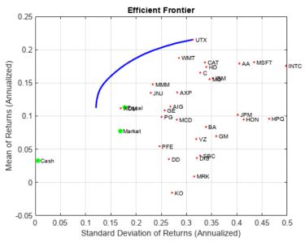
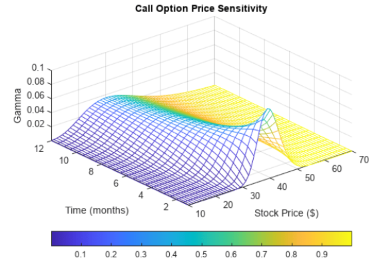
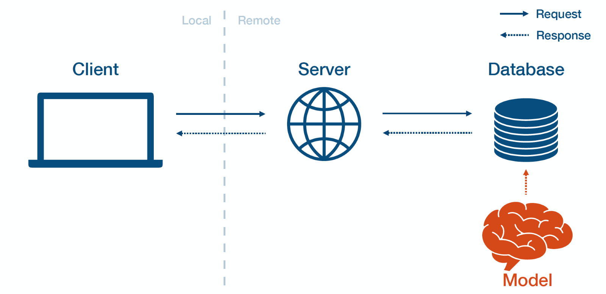

# Awesome MATLAB Quant Finance :computer: :chart:

## The World of Quantitative Finance!

Greetings and welcome to our quant finance page! Here you'll find a page filled with a range of quant topics, from managing your data to pricing models, with insightful and cool links about each one. As a quantitative finance engineer at MathWorks, I've personally found these links helpful when engaging with clients. Take a look - I hope you enjoy it too!

Sara Galante, sgalante@mathworks.com

## Popular Topics by Application

- [Data Management](#data-management)
- [Artificial Intelligence and Machine Learning](#artificial-intelligence-and-machine-learning)
- [Econometrics](#econometrics)
- [Risk Management](#risk-management)
- [Asset Management and Optimization](#asset-management-and-optimization)
- [Options and Derivatives](#options-and-derivatives)
- [Model Integration and Deployment](#model-integration-and-deployment)

## Data Management

<table>
	<tbody>
		<tr>
			<td> <b>Data Cleaning<b>  
			</td>
			<td><ul>
			<li><a href="https://www.mathworks.com/videos/automated-data-cleaning-and-preparation-in-matlab-1562608492563.html">Automated Data Cleaning and Preparation</a></li>
			
&nbsp;

			<li><a href="https://www.mathworks.com/videos/data-preprocessing-for-finance-1602504445109.html">Data Preprocessing for Finance</a></li>
			</ul></td>
		</tr>
	</tbody>
</table>

## Artificial Intelligence and Machine Learning

<table>
	<tbody>
		<tr>
		<td> <b>Machine Learning for Finance<b>  
			</td>
		<td><ul>
			
&nbsp;

			<li><a href="https://www.youtube.com/watch?v=ONNk9ypWzeU">Machine Learning for Risk Management: Fraud Detection Using Machine Learning</a></li>
			
&nbsp;

			<li><a href="https://github.com/matlab-deep-learning/reinforcement_learning_financial_trading">Code Example: Reinforcement Learning for Financial Trading</a></li>
			
&nbsp;

			<li><a href="https://www.mathworks.com/help/finance/backtest-strategies-using-deep-learning.html">Code Example: Backtest Strategies Using Deep Learning</a></li>
		</ul></td>
		</tr>
	</tbody>
</table>

## Econometrics

<table>
	<tbody>
		<tr>
			<td><b> Econometrics <b> 
			</td>
			<td><ul>
			<li><a href="https://www.mathworks.com/help/econ/filter-data-through-statespace-model-in-real-time.html">Nowcasting Code Example: Filter Data through State-Space Model in Real Time</a></li>
			
&nbsp;

			<li><a href="https://www.mathworks.com/videos/matlab-for-real-time-economics-1668422801893.htmll">Applying BEAR and Dynare: MATLAB for Real-Time Economics</a></li>
			
&nbsp;

			<li><a href="https://blogs.mathworks.com/finance/2025/03/20/the-economic-effects-of-tariff-changes/">Code Example: Economic Effects of Tariff Changes</a></li>
			</ul></td>
		</tr>
	</tbody>
</table>

## Risk Management

<table>
	<tbody>
		<tr>
			<td> <b>Risk Management <b>  
			</td>
			<td><ul>
			<li><a href="https://blogs.mathworks.com/finance/2025/03/03/assessing-climate-impacts-on-credit-risk/">Assessing Climate Impacts on Credit Risk</a></li>
			
&nbsp;

			<li><a href="https://www.mathworks.com/help/risk/estimate-var-using-parametric-methods.html">Code Example: Estimate VaR for Equity Portfolio Using Parametric Methods</a></li>
			
&nbsp;

			<li><a href="https://www.mathworks.com/help/risk/value-at-risk-estimation-and-backtesting.html">Value-at-Risk Estimation and Backtesting</a></li>
			</ul></td>
		</tr>
	</tbody>
</table>

## Asset Management and Optimization

<table>
	<tbody>
		<tr>
			<td> <b>Investment Optimization <b>  
			</td>
			<td><ul>
			<li><a href="https://blogs.mathworks.com/finance/2025/02/07/custom-portfolio-optimization-balancing-objectives-constraints-and-efficiency/">Custom Portfolio Optimization: Balancing Objectives, Constraints, and Efficiency</a></li>
			
&nbsp;

			<li><a href="https://github.com/mathworks/Quantum-Computing-MATLAB/tree/main/examples/portfolio-optimization">Asset Management and Quantum Computing: Portfolio Optimization using VQE-CVaR</a></li>
			
&nbsp;

			<li><a href="https://www.youtube.com/watch?v=e21MfMe5vtU">Asset Allocation - Building the Hierarchical Risk Parity Strategy</a></li>
			</ul></td>
		</tr>
	</tbody>
</table>

## Options and Derivatives

<table>
	<tbody>
		<tr>
			<td><b> Valuation and Pricing of Options and Derivatives <b> 
			</td>
			<td><ul>
			<li><a href="https://github.com/matlab-deep-learning/PINNsOptionPricing">Code Example: Physics-Informed Neural Networks for Option Pricing</a></li>
			
&nbsp;

			<li><a href="https://github.com/mathworks/climate-examples-commodity-volatility">Climate Examples: Volatility Forecasting of Commodities</a></li>
			
&nbsp;

			<li><a href="https://github.com/mathworks/Climate-IAM-Explorer/tree/d578e39616fe688dfd9665e15d1f5f0cac4d1d79/examples/Loan%20Portfolio%20Climate%20Stress%20Test">Code Example: Loan Portfolio Climate Stress Test</a></li>
			</ul></td>
		</tr>
	</tbody>
</table>

## Model Integration and Deployment

<table>
	<tbody>
		<tr>
			<td><b> System Integration and Model Deployment <b> 
			</td>
			<td><ul>
			<li><a href="https://github.com/mathworks/Trading-Analysis-in-MATLAB-using-Python">Code Example: Trading Analysis in MATLAB using Python</a></li>
			
&nbsp;

			<li><a href="https://www.mathworks.com/videos/deploying-matlab-models-to-web-and-production-for-finance-1607671433392.html">Deploying MATLAB Models to Web Production for Finance</a></li>
			
&nbsp;

			<li><a href="https://github.com/mathworks/how-to-turn-your-script-into-a-simple-app ">How to Turn Your Script into a Simple App</a></li>
			</ul></td>
		</tr>
	</tbody>
</table>

Questions?
Contact dwilling@mathworks.com

